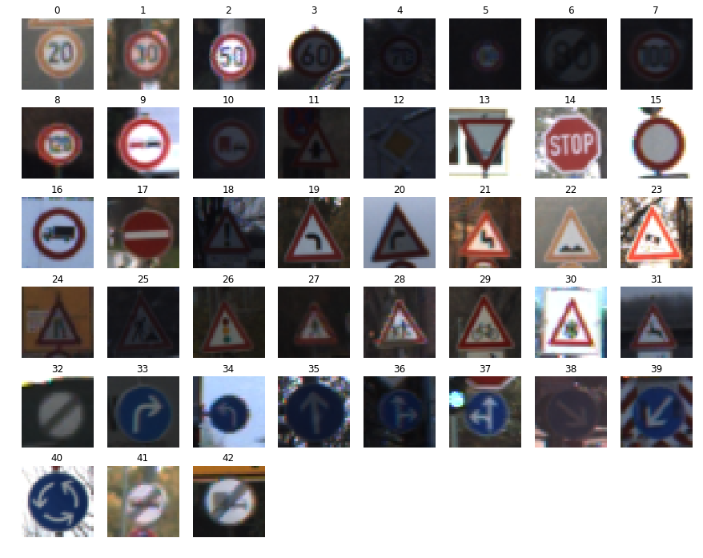
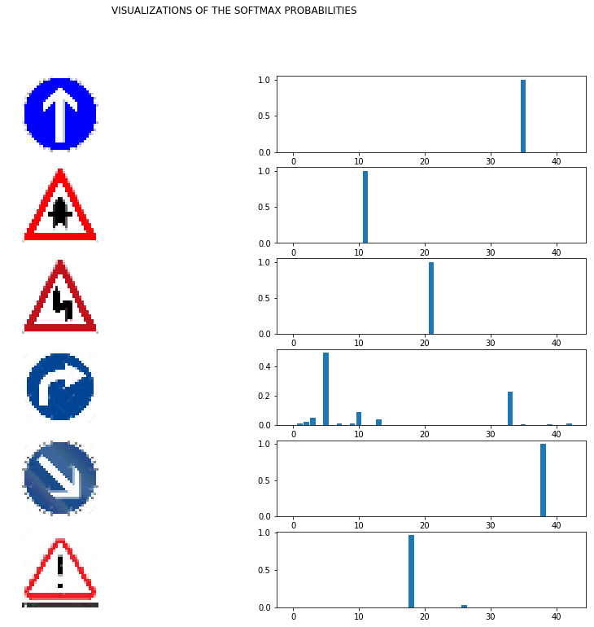

## Project: Build a Traffic Sign Recognition Program

Overview
---

Training a deep neural network to classify traffic signs.

Writeup
---
Writeup can be found [here](Writeup.pdf)

Sample Outputs
---

Image showing the various classes

Sample predictions of the softmax probabilities

